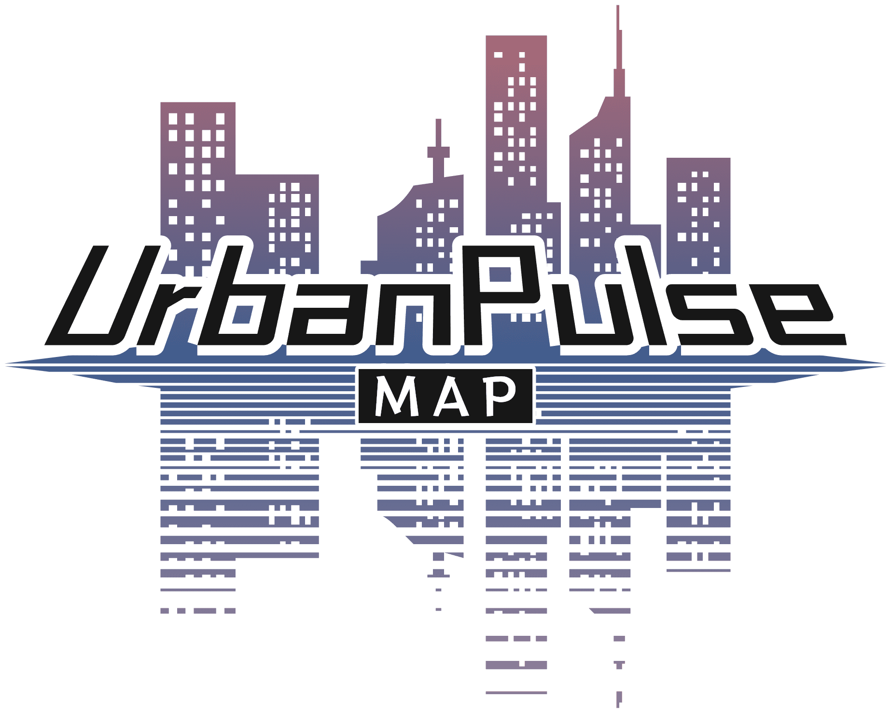

# Urban Pulse Map  
<!-- 项目 Logo -->

  

---

  
  
  
  

  🌍 **通过地理信息解读新闻动态 | 数据与技术的可视化创新** 🌍

---

## 简介
**Urban Pulse Map** 是一个正在开发的非商业项目，旨在整合公开新闻数据和地理信息，展示新闻事件的动态空间分布。  
项目完全开源，专注于教育与研究用途，探索新闻数据的合理使用和技术创新，目前聚焦于葡萄牙地区。

---

## 目标
- **技术创新**  
  探索自然语言处理（NLP）和机器学习技术在新闻行业的融合应用，实现事件地理信息的精准提取与空间展示。
- **直观展示**  
  利用动态地图展示新闻事件的空间维度，帮助公众更直观地理解社会动态和区域变化。

---

## 架构
Urban Pulse Map 采用模块化架构设计，确保灵活性与可扩展性：

- **数据获取层**  
  使用标准化 RSS 聚合引擎整合新闻数据源。  
  核心工具：`rss_aggregator.py`。

- **数据处理层**  
  基于 spaCy 的 NLP 模块，提取事件时间、地点等字段。  
  核心工具：`nlp.py`。

- **数据存储层**  
  使用 MongoDB 存储新闻数据与日志信息：
  - `news` 集合：存储处理后的新闻条目。
  - `logs` 集合：记录运行日志。

- **数据接口层**  
  提供 RESTful API，供前端获取数据。  
  核心文件：`routes.py` 和 `app.py`。

- **数据展示层**  
  基于 Vue.js 构建前端页面，包含交互式地图和新闻展示功能。

- **数据调度层**  
  调度数据获取与处理流程，计划支持 `cron` 优化任务调度。

---

## 技术栈
| 模块               | 技术选型              | 功能描述                           |
|--------------------|-----------------------|------------------------------------|
| **后端**           | Python, Flask, MongoDB | 提供 API 接口与数据存储           |
| **自然语言处理**   | spaCy                 | 提取新闻事件地理信息              |
| **前端**           | Vue.js, Vite, Nginx   | 动态地图与新闻内容展示页面         |
| **数据库**         | MongoDB               | 存储新闻数据与运行日志            |
| **调度工具**       | 原生 Python 脚本      | 自动化调度 RSS 和 NLP 处理流程     |

---

## 流程图
_详细数据流与项目架构图将在未来版本更新中提供。_

---

## 联系我们
- **GitHub 仓库**  
  [Urban Pulse Map](https://github.com/0xliu1shou/UrbanPulseMap_Source)  
  欢迎提交 [Issue](https://github.com/0xliu1shou/UrbanPulseMap_Source/issues) 或 [Pull Request](https://github.com/0xliu1shou/UrbanPulseMap_Source/pulls)。

- **电子邮件**  
  [info@upmap.cc](mailto:info@upmap.cc)

---

## 相关文档
- **[许可证信息](./LICENSE)**  
  项目采用 GPL-3.0 License，详细请参阅文件。
- **[免责声明（中文）](./docs/Disclaimer_cn.md)**  
  Urban Pulse Map 为非商业项目，具体免责内容请查看文档。
- **[贡献指南](./CONTRIBUTING.md)**  
  欢迎社区成员参与开发，查看贡献指南了解详情。

---

## 附注
Urban Pulse Map 是推动技术与数据可视化发展的开源项目，完全基于教育和研究用途。我们将持续优化功能，以满足更多需求场景。
