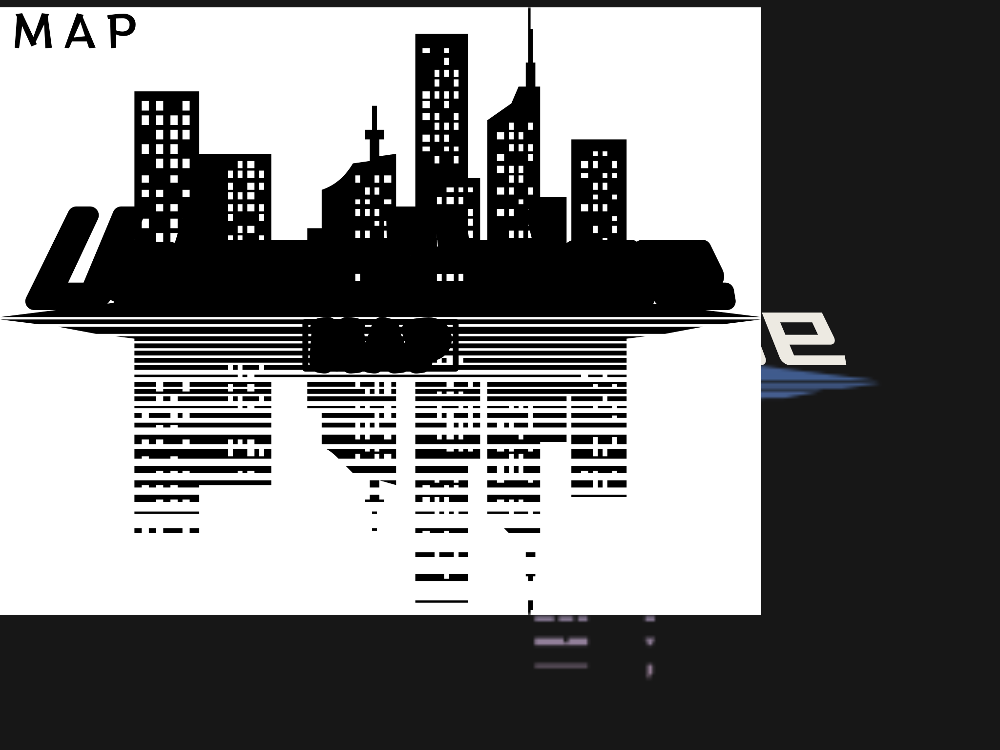

<!-- 项目 Logo / Project Logo -->

  <picture>
    <source srcset="./docs/assets/UrbanPulseMap_LOGO_reverse_color.png" media="(prefers-color-scheme: dark)">
    <source srcset="./docs/assets/UrbanPulseMap_LOGO.png" media="(prefers-color-scheme: light)">
    
  </picture>

---

  
  
  
  
  

---

## Introduction
**Urban Pulse Map** is a non-commercial project under development. It aims to integrate public news data and geographical information to visualize the dynamic spatial distribution of news events.  
The project is fully open-source, dedicated to education and research, and explores the practical applications of ethical use of public news data and technological innovation.

---

## Goals
- **Technical Exploration**  
  Investigate the feasibility and practical potential of integrating natural language processing (NLP) and machine learning in the news industry.
- **Model Development**  
  Focus on news geographical information analysis techniques to develop pre-trained models capable of accurately identifying event locations from brief news summaries.
- **Interactive Visualization**  
  Research interactive map-based visualization methods to help the public better understand the spatial dimensions and dynamic changes of news events.

---

## Architecture & Technology Stack
Urban Pulse Map adopts a modular architecture to ensure flexibility and scalability:

| Module                    | Technology            | Description                                                               |
|---------------------------|-----------------------|---------------------------------------------------------------------------|
| **Data Acquisition Layer**| Python                | Standardized RSS aggregation engine to integrate news sources             |
| **Data Processing Layer** | spaCy                 | NLP-based analysis for extracting geographical information                |
| **Data Storage Layer**    | MongoDB               | Store processed news data and operation logs                              |
| **API Layer**             | Flask (WSGI)          | Provide RESTful API endpoints, planned to support `WSGI` for optimization |
| **Outcomes Presentation** | Vue.js, Vite, Nginx   | Provide a demo webpage for technical visualization                        |
| **Tasks Runner**          | Python (cron)         | Manage data acquisition and processing, planned to support `cron`         |

---

## Workflow
_Detailed data flow and workflow diagrams will be included in future updates._

---

## Important Links and Documentations
- **[License](./LICENSE)**  
  The project is licensed under GPL-3.0 License.  

- **[Disclaimer](./docs/Disclaimer_en.md)**  
  Urban Pulse Map is a non-commercial project. Please see the disclaimer for details.  

- **Email: [info@upmap.cc](mailto:info@upmap.cc)**  
  For any questions or suggestions, feel free to reach out to us via email, and we will respond promptly.
  
- **Demo: [upmap.cc](https://upmap.cc)**
  - Click to access the project demo.
  - **Note:** This demo is for conceptual display purposes only and not intended for commercial use.
---

  
  
  
  
  

---

## 简介
**Urban Pulse Map** 是一个开发中的非商业项目，旨在整合公开新闻数据和地理信息，展示新闻事件的动态空间分布。  
项目完全开源，专注于教育与研究用途，探索新闻数据的合理使用和技术创新。

---

## 目标
- **技术探索**  
  探索自然语言处理（NLP）与机器学习技术在新闻行业深度融合的可行性与实际应用潜力。
- **模型构建**  
  聚焦新闻地理信息分析技术，开发预训练模型，通过有限的新闻摘要信息精准识别事件的发生地点。
- **直观展示**  
  研究基于交互式地图的可视化方法，能否帮助公众直观理解新闻事件的空间维度和动态变化。

---

## 技术栈
Urban Pulse Map 采用模块化架构设计，确保灵活性与可扩展性：

| 模块               | 技术选型               | 功能描述                                                    |
|-------------------|-----------------------|------------------------------------------------------------|
| **数据获取层**      | Python                | 使用标准化 RSS 聚合引擎整合新闻数据源                           |
| **数据处理层**      | spaCy                 | 基于自然语言处理，分析新闻事件的地理信息                         |
| **数据存储层**      | MongoDB               | 存储处理后的新闻数据与运行日志                                 |
| **数据接口层**      | Flask (WSGI)          | 提供 RESTful API 接口，供前端获取数据，计划支持 `WSGI` 优化稳定性 |
| **数据展示层**      | Vue.js, Vite, Nginx   | 提供 Demo 页面作为技术展示                                    |
| **数据调度层**      | Python (cron)         | 调度数据获取与处理流程，计划支持 `cron` 优化任务调度              |

---

## 流程图
_详细数据流与工作流程图将在未来版本更新中提供。_

---

## 重要链接及相关文档
- **[许可证信息](./LICENSE)**  
  项目采用 GPL-3.0 License，详细请参阅文件。
- **[免责声明（中文）](./docs/Disclaimer_cn.md)**  
  Urban Pulse Map 为非商业项目，具体免责声明请查看文档。
- **电子邮件：[info@upmap.cc](mailto:info@upmap.cc)**  
  如果您有任何问题或建议，欢迎通过电子邮件与我们联系，我们将尽快回复。
- **概念演示：[upmap.cc](https://upmap.cc)**
  - 点击访问项目在线演示。
  - **注意**：此 Demo 仅为概念演示，非商业产品。
